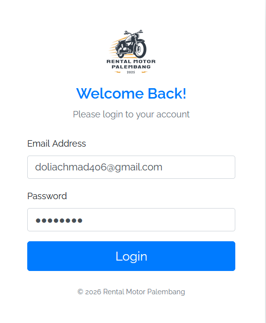

# 🏍️ IoT-Based Remote Monitoring & Control System for Motorcycle Rentals

<p align="center">
  
  
  
</p>

## 📌 Project Overview
A professional-grade IoT ecosystem built to solve security vulnerabilities in the motorcycle rental industry. This project integrates a high-precision hardware module with a web-based dashboard, enabling fleet owners to track, monitor, and remotely control vehicles in real-time.
**This project was developed in collaboration with a local rental partner in Palembang and has been validated through scientific publication.**

## 📌 Project Context
This project was developed as a Final Thesis (Independent Project) for my Computer Engineering degree at State Polytechnic of Sriwijaya.

---

## 🚀 Key Features
- **📍 Live Tracking:** Real-time geospatial monitoring using Ublox NEO-6M.
- **🛡️ Polygon Geofencing:** Advanced boundary detection using the Ray Casting Algorithm for precise administrative-level accuracy.
- **🔌 Remote Kill-Switch:** Automated engine immobilization via Relay modules when the vehicle exits the Palembang geofence or rental time expires.
- **🔊 Smart Alarm System:** Built-in buzzer/speaker that automatically triggers when the vehicle exits the Palembang area or when the rental time is about to expire, providing immediate on-vehicle warning.
- **🤖 Telegram Bot Integration:** Instant push notifications for rental expiration and geofence exit alerts.
- **📊 Admin Control Center:** A centralized Laravel-based dashboard for managing rental operations, including rental time configuration, customer management, and motorcycle fleet registration.
---

## 🧠 Comprehensive Reasoning (The "Why")

### **The Problem: Structural Vulnerabilities**
Motorcycle rentals face two "silent killers": **Large-scale embezzlement** and **manual management gaps**.
- **Real Threat:** Recent cases (Jan 2025) showed 20 units stolen by one fraudster, causing ~Rp400M in losses  (Humas Polres Bantul, 2025).
- **Operational Gap:** Manual logging results in zero real-time visibility, leading to delayed returns and untraceable theft.

### **The Research: Beyond Basic Tracking**
Standard circular geofencing is imprecise for urban use. My research focuses on **strict, administrative-based boundaries** to provide the high-level security that rental businesses actually require.

### **The Solution: Why Polygon & Remote Control?**
1. **Precision Logic:** Used **Polygon Geofencing (Ray Casting Algorithm)** to follow the exact administrative borders of Palembang City—far more accurate than standard radii.
2. **Proactive Intervention:** Integrated a **Remote Kill-Switch (Relay)**. The system doesn't just monitor; it automatically immobilizes the engine if a boundary breach or time expiration occurs.
3. **Automated Ecosystem:** Integrated **Laravel, APIs, and Telegram** to replace manual workflows with a seamless, real-time alert and control system.

### Real-World Impact
- **Accuracy:** Proven GPS deviation of only **12.10 meters**.
- **Efficiency:** Reduced manual monitoring workload by **100%** through automated logic triggers.

---

## 🤝 Collaboration & Partnership
This system was field-tested in collaboration with **Rental Motor Palembang founded by Ihsan Fikri**, a local motorcycle rental business. 
- **Field Test Goal:** To ensure hardware durability and GPRS connectivity reliability in high-mobility urban scenarios.
- **Result:** Successful integration and real-time intervention capabilities during active rental periods.

---

## 📚 Scientific Publication
The methodology and technical implementation of this project have been peer-reviewed and published:
- **Title:** "Rancang Bangun Sistem Monitoring dan Kontrol Jarak Jauh pada Rental Motor Berbasis IoT dengan Geofencing"
- **Journal:** JATI : Jurnal Mahasiswa Teknik Informatika
- **Status:** Published (2025)
- **🔗 [https://doi.org/10.36040/jati.v9i5.14983]**

---

## 🛠️ Tech Stack
| Category | Tools & Technologies |
| :--- | :--- |
| **Hardware** | Arduino Mega 2560, SIM7000G (LTE/GSM), Ublox NEO-6M, Relay, Buzzer |
| **Backend** | Laravel (PHP), MySQL |
| **Geospatial** | QGIS, Geopandas (Python), Ray Casting Algorithm |
| **Frontend** | Bootstrap 5, JavaScript, Leaflet.js (Maps) |

---
## ⚙️ Installation & System Setup

### 1. Clone Repository

```bash
git clone https://github.com/achmaddoli/Motorcycle-Rental-Monitoring-System.git
cd Motorcycle-Rental-Monitoring-System
```

---

## 💻 Backend Setup (Laravel)

### 2. Install Dependencies

```bash
composer install
npm install
```

### 3. Setup Environment

```bash
cp .env.example .env
php artisan key:generate
```

### 4. Configure Database

Create a new MySQL database, for example:

```sql
db_rental_motor
```

Update your `.env` file:

```env
DB_DATABASE=db_rental_motor
DB_USERNAME=root
DB_PASSWORD=
```

### 5. Import Database / Run Migration

If you provide an SQL file:

```bash
Import the provided .sql file into MySQL
```

Or if using migrations:

```bash
php artisan migrate
```

### 6. Run Laravel Server

```bash
php artisan serve
npm run dev
```

---

## 🔌 Hardware Setup (Arduino Mega)

### 7. Required Hardware

* Arduino Mega 2560
* SIM7000G
* Ublox NEO-6M
* Relay module
* Buzzer
* Li-Po Battery
* UBEC

### 8. Upload Firmware to Arduino

Open the Arduino IDE, then upload the firmware source code which is Microcontroller Program.ino.

Make sure the required Arduino libraries are installed:

* TinyGPSPlus
* TinyGSM
* ArduinoHttpClient

### 9. Configure Firmware

Before uploading, adjust the following inside the Arduino code:

* GSM/APN provider configuration
* Laravel API endpoint URL
* Vehicle ID or device ID
* Relay and buzzer pin definitions

Example:

```cpp
const char server[] = "your-domain.com";
const char resource[] = "/api/location/update";
String vehicle_id = "MTR001";
```

---

## 🤖 Telegram Bot Setup

### 10. Configure Telegram Bot

Create a bot using **@BotFather**, then add the token into your Laravel `.env` file:

```env
TELEGRAM_BOT_TOKEN=your_bot_token_here
```

Also make sure each customer/user record includes a valid Telegram chat ID.

---

## 🔄 Full System Workflow

### 11. How to Run the Full System

1. Turn on the Laravel server and database
2. Power the Arduino Mega device
3. Arduino reads GPS coordinates from Ublox NEO-6M
4. SIM7000G sends location data to Laravel API
5. Laravel checks:

   * geofence status (inside/outside Palembang)
   * rental time status
6. Laravel sends response back to Arduino
7. Arduino triggers:

   * relay for engine cut-off
   * buzzer for warning
8. Laravel sends Telegram notifications when needed

---

## 📌 Notes

* This project is an **integrated IoT + Web system**, so both the Laravel backend and Arduino hardware must be configured correctly.
* The website alone does not represent the full system.

---

## 📺 Visuals & Simulation

### 💻 Website Dashboard Interface
*The management system features 6 core modules: Authentication, Real-time Dashboard, Live Monitoring, Rental Logs, User Management, and Vehicle Fleet Data.*

| 🔐 Login Page | 📊 Main Dashboard | 📡 Live Monitoring |
| :---: | :---: | :---: |
|  |  |  |
| **🏍️ Vehicle Fleet** | **👥 User Management** | **🔑 Rental Records** |
|  |  |  |

---

### 🤖 Telegram Notification System
| Security & Duration Alerts |
| :---: |
|  |
| *Automated alerts for geofence breaches & rental duration warnings* |

---
### 🎥 Video Demonstrations
*Click the thumbnails below to watch the system in action.*

#### **1. Real Simulation (Outside Palembang City)**
[](https://youtu.be/UiRfMmB3ZiQ)
> **Simulation Focus:** Demonstrates real-world hardware response: buzzer activation and automatic engine cut-off when the vehicle exits the Palembang geofence.

#### **2. Full Website System Demo**
[](https://youtu.be/uYgXGPgfSG0)
> **System Focus:** Showcases the complete workflow across 6 modules: Login, Dashboard, Monitoring, Rental, User, and Vehicle Management.
---

## 📈 Learning Journey
Building this "End-to-End" system sharpened my skills in **Systems Thinking**. I learned to bridge the gap between physical hardware and cloud-based software, while managing the complexities of real-time geospatial data processing. Beyond technical skills, I learned how to communicate technical limitations to non-technical stakeholders (the rental owners) and adapt the system based on their real-world feedback

---

